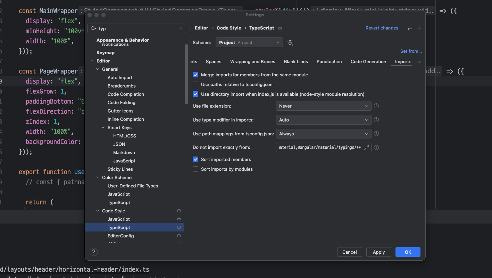
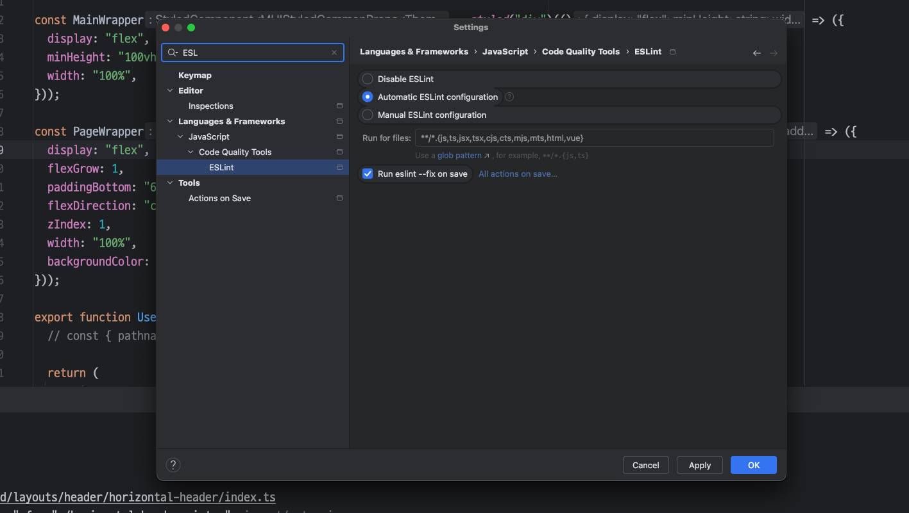

# 관리자 페이지 FrontEnd

- 초기 실행: Nodejs 설치 필요
  - `npm i`
  - `npm run dev`
- React-19

## FSD 구조

https://www.youtube.com/watch?v=64Fx5Y1gEOA  
영상 내용 숙지 필수!! 내용을 이해했다고 가정하고 작성했습니다!  
`아래 설명은 초기 세팅 기준으로 추후에 확장될 수 있습니다.`  
index.ts를 통해 import 경로를 관리한다.

- app - 최상위 Comp 관리 전역 Comp, Router, Axios intercepter 설정

  - AlertDialogProvider : 공용 Alert 창 정의 ( 확인, 취소 )
  - SnackbarProvider: 공용 Snackbar( 알림 창 ) UI 정의
  - QueryClientProvider: React-Query Client 정의
  - RouterProvider: 해당 프로젝트 Routing 정보 정의

- entities - 프론트에서 활용할 Entity 정의 ( 화면에 표현될 Object 정의 및 관리 )

  - \*.contracts: Object Schema 정의
  - \*.type: Object Schema Type 정의
  - \*.lib: 백엔드 Response Object -> 프론트 화면을 위한 entity Object 변환 로직
  - \*.queries: 공용 ( 다수 feature 에서 사용할 ) react-query 정의
  - \*.filter: 해당 Entity가 갖게 될 전역 Filter 상태 값 생성 및 관리

- pages - 해당 Entity 페이지 기본 Layout 및 Routing 등 정의

  - \*.model - 페이지 Rendering 을 위한 기본 데이터 Load
  - \*.route - 페이지 Router 정의
  - \*.skeleton - 해당 페이지 Suspense 화면 정의
  - \*.ui - 해당 페이지 Layout 정의

- features - pages에 들어갈 세부 기능 및 Comp 에 대한 정의

- share - 공용으로 사용될 Comp, API 정의
  - ui - 공용 UI Comp
  - lib - react-library 초기 설정 및 선언
  - store - zustand 전역 상태 Store 정의
  - hooks - react-custom Hook 정의
  - hoc - react-custom Component 정의
  - constants - 상수 값 정의
  - api - 각 Domain 에 활용될 axios 명령 관리

## ESLint, Prettier 코드 퀄리티 보장 도구

`vscode 사용자라면 ESLint, Prettier - Code formatter, Prettier ESLint 플러그인 설치`

- IDE setting 에서
  
  

위 설정 적용

코드 Clone, Pull 수행 후 LF 컴파일 오류 발생 시  
`npm run prettier:all` 명령어 실행을 통해 코드 정렬 수행  
해당 규칙은 설정파일을 통해 정의됨

## 프록시 및 설정은 Root 경로의 파일에 정의
